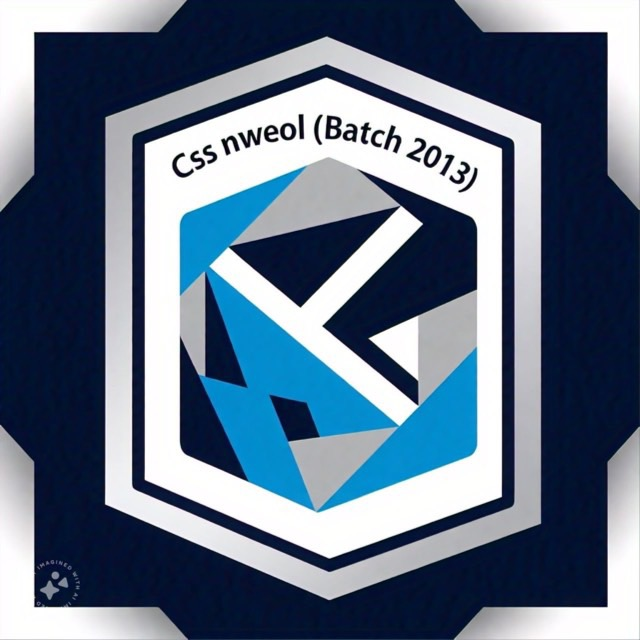
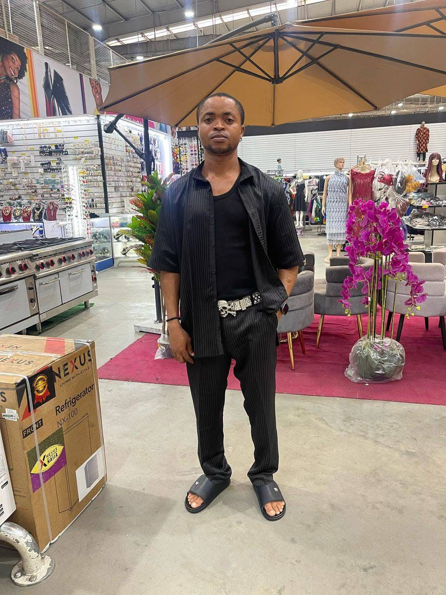

<html>
<head>
<title>Executive Members</title>

</head>

<body>

    
    <h1>Executive Council</h1>
    
CSS NWEOL BATCH 2013

    
    <h2>Adomagio Probel</h2>
    
President

    
    <h2>Lucky Boy</h2>
    
Vice President

    
    <h2>BARRY</h2>
    
Secretary

    
    <h2>XAN G</h2>
    
PRO

    
    <h2>DANIBARI</h2>
    
PRO

    <a href="index.html">Back to Home</a>

</body>
</html>

